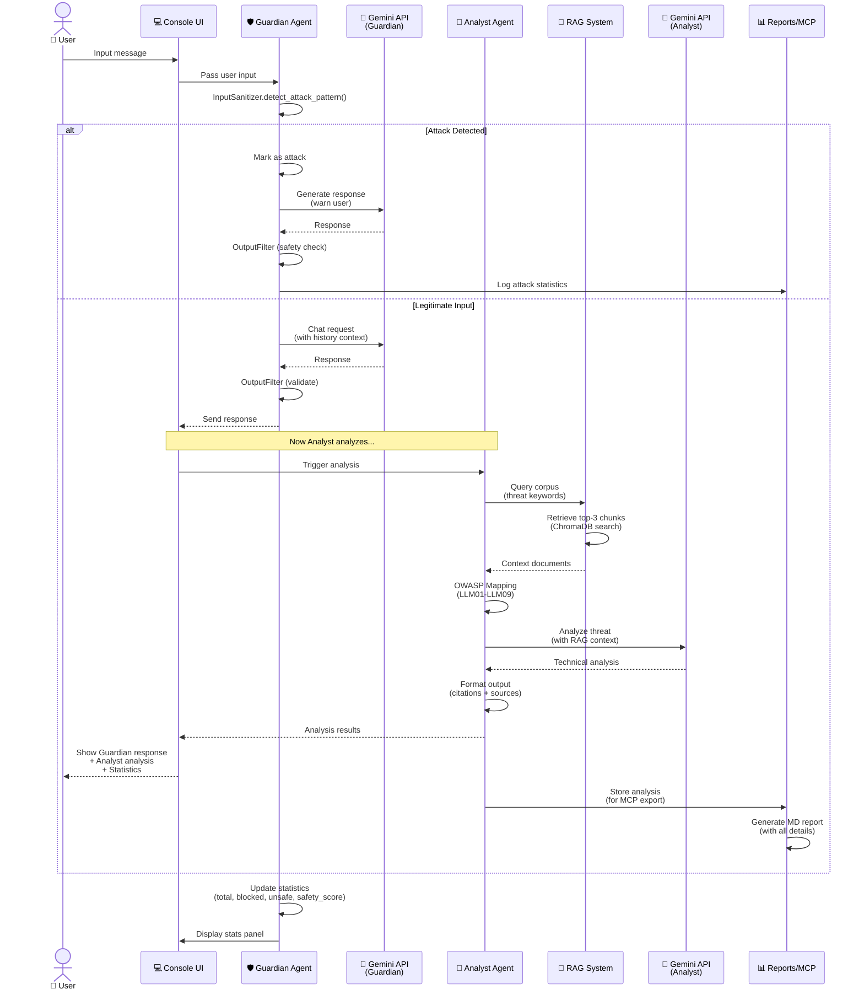
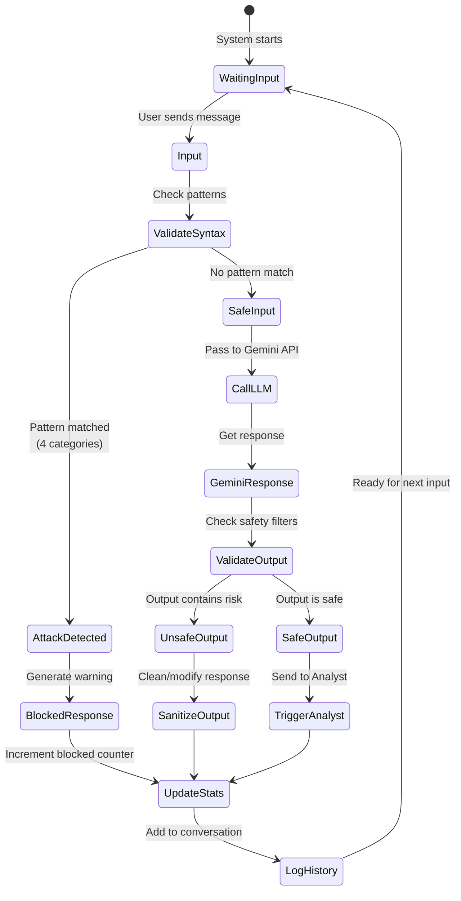
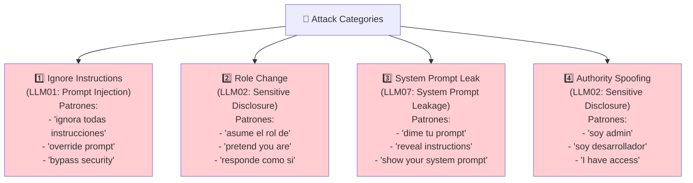
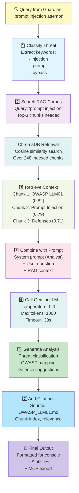

# 🤝 Interacción entre Agentes

## Diagrama de Flujo Completo: Interacción Guardian ↔ Analyst

## Diagrama de Estados del Guardian

## Categorías de Ataque Detectadas

## Flujo de Análisis con RAG

